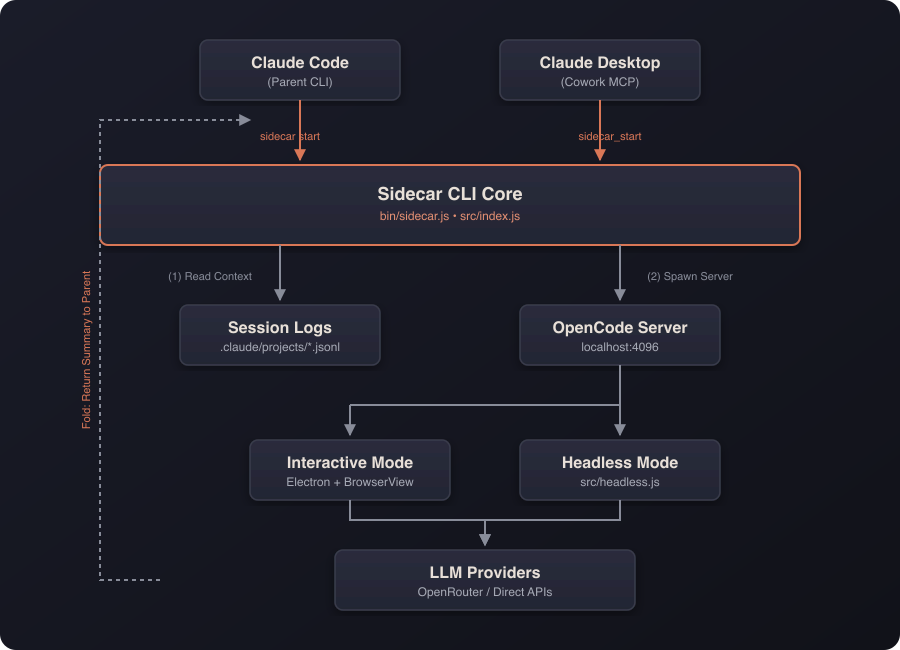

<div align="center">

# Claude Sidecar

**A parallel AI window that shares your context. Talk to any model while your main session keeps working.**


Sidecar opens a real UI alongside Claude Code or Cowork, pre-loaded with your conversation context, connected to Gemini 3, GPT-5.4, DeepSeek, or any other model. You interact with the sidecar in parallel (fact-check Claude's work, get a second opinion, explore a tangent) then fold the results back when you're ready.

> **Supported clients:** Claude Code CLI and Claude Cowork are fully tested and supported. Claude Code web and Claude Desktop are experimental.

[](https://www.npmjs.com/package/claude-sidecar)
[](./LICENSE)
[](https://nodejs.org)
[](./CONTRIBUTING.md)
[](https://github.com/jrenaldi79/claude-sidecar)

</div>

---

## Table of Contents

- [What Is Sidecar?](#what-is-sidecar)
- [Use Cases](#use-cases)
- [Getting Started](#getting-started)
- [Quick Start](#quick-start)
- [How It Works](#how-it-works)
- [Features](#features)
- [Commands](#commands)
- [Agent Modes](#agent-modes)
- [Models](#models)
- [MCP Integration](#mcp-integration)
- [Understanding Sidecar Output](#understanding-sidecar-output)
- [Troubleshooting](#troubleshooting)
- [Documentation](#documentation)
- [Contributing](#contributing)
- [Built On](#built-on)
- [License](#license)

---

## What Is Sidecar?

Sidecar is a **literal second window** that runs alongside your Claude Code or Cowork session. It:

1. **Shares your context.** Your current conversation history is automatically extracted and passed to the sidecar. No copy-pasting, no re-explaining.
2. **Runs in parallel.** Your main Claude session keeps working while you interact with the sidecar. It's not sequential, it's simultaneous.
3. **Connects to any model.** Gemini 3 Pro (1M context), GPT-5.4, DeepSeek R1, Grok: whatever's best for the job.
4. **Folds back cleanly.** When you're done, click FOLD and a structured summary returns to your main context. No noise, just results.


---

## Use Cases

### Fact-Check Claude's Work
Claude just proposed an architecture or made a claim? Open a sidecar to a different model and verify it, with full context already loaded.

### Get a Second Opinion on a Feature
Designing something complex? Fork the conversation to Gemini or GPT-5.4 for an independent take. Compare approaches before committing to one.

### Deep-Dive Without Polluting Context
Need to explore a rabbit hole (trace a bug, read a huge file, research an API)? Do it in the sidecar. Your main session stays clean and focused.

### Parallel Investigation
While Claude implements a fix, spin up a sidecar to review the test coverage, audit security implications, or draft documentation, all at the same time.

### Leverage Model Strengths
- **Gemini 3 Pro**: 1M token context for analyzing entire codebases
- **GPT-5.4**: Strong at code generation and refactoring
- **DeepSeek R1**: Cost-effective reasoning at scale
- **Grok**: Fast iteration and broad knowledge

---

## Getting Started

### Prerequisites

- Node.js 18+

### 1. Install

```bash
npm install -g claude-sidecar
```

On install, sidecar automatically:
- Registers a **Skill** in `~/.claude/skills/sidecar/` so Claude Code knows how to use sidecars
- Registers an **MCP server** for Claude Desktop and Cowork

### 2. Run Setup

```bash
sidecar setup
```

This launches a **graphical setup wizard** that walks you through everything:

| Step | What It Does |
|------|-------------|
| **1. API Keys** | Enter keys for OpenRouter, Google, OpenAI, and/or Anthropic. Each key is validated live against the provider's API. Keys are stored locally at `~/.config/sidecar/.env` with restricted permissions (0600). |
| **2. Default Model** | Choose your go-to model (Gemini 3 Flash, Gemini 3 Pro, GPT-5.4, Opus 4.6, or DeepSeek). This is what sidecar uses when you omit `--model`. |
| **3. Model Routing** | Configure which provider serves each model. If you have both an OpenRouter key and a direct Google key, you can route Gemini through Google directly and everything else through OpenRouter. |
| **4. Review** | Summary of your configuration before saving. |

> **Headless environments:** If Electron isn't available, the wizard falls back to a readline-based setup in the terminal.

You can also manage individual settings without re-running the full wizard:

```bash
sidecar setup --add-alias fast=openrouter/google/gemini-3-flash-preview
```

### 3. Verify

```bash
sidecar start --model gemini --prompt "Hello, confirm sidecar is working"
```

A window should open alongside your editor with Gemini ready to chat, pre-loaded with your Claude Code context.

---

## Quick Start

```bash
# Fact-check: open a sidecar to verify Claude's approach
sidecar start --model gemini --prompt "Fact-check the auth approach Claude just proposed"

# Second opinion: get a different model's take
sidecar start --model gpt --prompt "Review this feature design. Is there a simpler approach?"

# Deep dive: investigate without polluting your main context
sidecar start --model gemini-pro --prompt "Analyze the entire codebase architecture"

# Headless: autonomous, no UI, summary returns automatically
sidecar start --model gemini --prompt "Generate Jest tests for src/utils/" --no-ui

# Use your configured default model (just omit --model)
sidecar start --prompt "Security review the payment module"
```

---

## How It Works

1. **Context sharing.** Sidecar reads your Claude Code session from `~/.claude/projects/[project]/[session].jsonl` and passes it to the sidecar model automatically.
2. **Window launch.** An Electron window opens alongside your editor with the sidecar UI (OpenCode-powered).
3. **Parallel interaction.** You converse with the sidecar model while your main Claude session continues working independently.
4. **Fold.** Click FOLD (or press `Cmd+Shift+F`) to generate a structured summary.
5. **Context return.** The summary flows back into your Claude Code context for Claude to act on.

The Electron shell uses a **BrowserView** architecture: the OpenCode web UI loads in a dedicated viewport, while the sidecar toolbar (branding, timer, Fold button) renders in the bottom 40px. No CSS conflicts with the host app.



---

## Features

### Interactive + Headless Modes

**Interactive (default):** Opens a window alongside Claude Code. You converse with the sidecar, steer the investigation, then click **FOLD** to generate a structured summary. Switch models mid-conversation without restarting.

**Headless (`--no-ui`):** The agent works autonomously in the background. When done, outputs a `[SIDECAR_FOLD]` summary automatically. Ideal for bulk tasks: test generation, documentation, linting.

### Context Passing

Your conversation history is automatically shared with the sidecar. No re-explaining needed. Filter by turns (`--context-turns`) or time window (`--context-since 2h`).

### Adaptive Personality

Sidecar detects its launch context and adapts:
- **From Claude Code** (`--client code-local`): Engineering-focused (debug, implement, review)
- **From Cowork** (`--client cowork`): General-purpose (research, analyze, write, brainstorm)

### Safety Features

- **Conflict detection**: Warns when files changed externally while the sidecar was running
- **Drift awareness**: Indicates when the sidecar's context may be stale relative to your current session
- **Pre-flight validation**: All CLI inputs are validated before anything launches

### Auto-Update

Sidecar checks the npm registry for updates once every 24 hours (cached, zero-latency background check). When an update is available:

- **CLI:** A notification box appears in your terminal after any command
- **Electron UI:** A banner appears above the toolbar with a one-click **Update** button. No terminal commands needed.

```bash
# Or update manually from the CLI
sidecar update
```

### Session Persistence

Every sidecar is persisted. List past sessions, read their summaries, reopen them, or chain them together.

```bash
sidecar list                           # See all past sidecars
sidecar read abc123                    # Read the summary
sidecar resume abc123                  # Reopen the exact session
sidecar continue abc123 --prompt "..." # New session building on previous findings
```

### MCP Integration

Full MCP server for Claude Desktop and Cowork. Sidecar tools appear natively inside Cowork's sandboxed environment. No CLI required.

---

## Commands

### `sidecar start`: Launch a Sidecar

```bash
sidecar start --model <model> --prompt "<task>"
```

| Option | Description | Default |
|--------|-------------|---------|
| `--model` | Model to use (alias or full string) | Config default |
| `--prompt` | Task description / briefing | *(required)* |
| `--no-ui` | Headless autonomous mode | false |
| `--agent` | Agent mode: `Chat`, `Plan`, `Build` | `Chat` |
| `--timeout` | Headless timeout in minutes | 15 |
| `--context-turns N` | Max conversation turns to include | 50 |
| `--context-since` | Time filter: `30m`, `2h`, `1d` | |
| `--context-max-tokens N` | Context size cap | 80000 |
| `--thinking` | Reasoning effort: `none` `minimal` `low` `medium` `high` `xhigh` | `medium` |
| `--summary-length` | Output verbosity: `brief` `normal` `verbose` | `normal` |
| `--session-id` | Explicit Claude Code session ID | Most recent |
| `--mcp` | Add MCP server: `name=url` or `name=command` | |
| `--mcp-config` | Path to `opencode.json` with MCP config | |
| `--client` | Client context: `code-local` `cowork` (`code-web` experimental) | `code-local` |

### `sidecar list`: Browse Past Sessions

```bash
sidecar list                    # Current project
sidecar list --status complete  # Completed only
sidecar list --all              # All projects
sidecar list --json             # JSON output
```

### `sidecar resume`: Reopen a Session

```bash
sidecar resume <task_id>
```

Reopens the exact OpenCode session with full conversation history preserved.

### `sidecar continue`: Build on Previous Work

```bash
sidecar continue <task_id> --prompt "Now implement the fix from the analysis"
```

Starts a **new** session with the previous session's conversation as read-only background context. Optionally switch models.

### `sidecar read`: Read Session Output

```bash
sidecar read <task_id>                  # Summary (default)
sidecar read <task_id> --conversation   # Full conversation
sidecar read <task_id> --metadata       # Session metadata
```

### `sidecar setup`: Configure Sidecar

```bash
sidecar setup                                           # Full setup wizard (GUI)
sidecar setup --add-alias fast=openrouter/google/gemini-3-flash-preview
```

Opens the graphical setup wizard for API keys, default model, model routing, and aliases. See [Getting Started](#2-run-setup) for details.

### `sidecar update`: Update to Latest Version

```bash
sidecar update
```

Updates sidecar to the latest npm release. In the Electron UI, click the **Update** button in the banner instead. No terminal needed.

---

## Agent Modes

Three primary modes control what the sidecar can do autonomously:

| Agent | Reads | Writes/Bash | Best For |
|-------|-------|-------------|----------|
| **Chat** *(default)* | Auto-approved | Asks permission | Questions, analysis, fact-checking, guided exploration |
| **Plan** | Auto-approved | Blocked entirely | Code review, architecture analysis, security audits |
| **Build** | Auto-approved | Auto-approved | Implementation tasks, test generation, headless batch work |

```bash
# Chat: good for fact-checking and analysis with human-in-the-loop (default)
sidecar start --model gemini --prompt "Verify Claude's approach to the auth refactor"

# Plan: strict read-only, no changes possible
sidecar start --model gemini --agent Plan --prompt "Security review of the payment module"

# Build: full autonomy, use when you explicitly want it to write code
sidecar start --model gemini --agent Build --no-ui \
  --prompt "Generate comprehensive Jest tests for src/utils/"
```

> **Headless mode note:** `--no-ui` defaults to `Build`. The `Chat` agent requires interactive UI for write permissions and stalls in headless mode.

---

## Models

### Using Aliases (after `sidecar setup`)

| Alias | Model |
|-------|-------|
| `gemini` | Gemini 3 Flash (fast, 1M context) |
| `gemini-pro` | Gemini 3 Pro (deep analysis, 1M context) |
| `gpt` | GPT-5.4 (code generation, refactoring) |
| `opus` | Claude Opus 4.6 (complex reasoning) |
| `deepseek` | DeepSeek R1 (cost-effective reasoning) |
| *(omit `--model`)* | Your configured default |

### Using Full Model Strings

| Access | Format | Example |
|--------|--------|---------|
| OpenRouter | `openrouter/provider/model` | `openrouter/google/gemini-3-pro-preview` |
| Direct Google | `google/model` | `google/gemini-3-flash` |
| Direct OpenAI | `openai/model` | `openai/gpt-5.4` |
| Direct Anthropic | `anthropic/model` | `anthropic/claude-opus-4-6` |

The prefix determines which credentials are used. Model names evolve; verify current names:

```bash
curl https://openrouter.ai/api/v1/models | jq '.data[].id' | grep -i gemini
```

---

## MCP Integration

For Claude Desktop and Cowork, sidecar exposes a full MCP server auto-registered on install.

To register manually:
```bash
claude mcp add-json sidecar '{"command":"sidecar","args":["mcp"]}' --scope user
```

| MCP Tool | Description |
|----------|-------------|
| `sidecar_start` | Spawn a sidecar (returns task ID immediately) |
| `sidecar_status` | Poll for completion |
| `sidecar_read` | Get results: summary, conversation, or metadata |
| `sidecar_list` | List past sessions |
| `sidecar_resume` | Reopen a session |
| `sidecar_continue` | New session building on previous |
| `sidecar_setup` | Open setup wizard |
| `sidecar_guide` | Get usage instructions |

**Async pattern:** `sidecar_start` returns a task ID immediately. Poll with `sidecar_status`, then read results with `sidecar_read`. This is non-blocking: the calling agent can do other work while the sidecar runs.

---

## Understanding Sidecar Output

Every fold produces a structured summary:

```markdown
## Sidecar Results: [Title]

**Context Age:** [How stale the context might be]
**FILE CONFLICT WARNING** [If files changed while the sidecar ran]

**Task:** What was requested
**Findings:** Key discoveries
**Attempted Approaches:** What was tried but didn't work
**Recommendations:** Concrete next steps
**Code Changes:** Specific diffs with file paths
**Files Modified:** List of changed files
**Assumptions Made:** Things to verify
**Open Questions:** Remaining uncertainties
```

---

## Troubleshooting

| Issue | Cause | Solution |
|-------|-------|---------|
| `command not found: opencode` | OpenCode binary not found | Reinstall: `npm install -g claude-sidecar` (opencode-ai is bundled) |
| 401 Unauthorized / auth errors | API key missing or wrong provider prefix | Run `sidecar setup` to configure keys, or verify `openrouter/...` prefix matches your credentials |
| Headless stalls silently | `Chat` agent in headless mode | Use `--agent build`, not `--agent chat` in headless mode |
| Session not found | No matching session ID | Run `sidecar list`, or omit `--session-id` to use most recent |
| No conversation history found | Project path encoding | Check `ls ~/.claude/projects/`. `/` and `_` are encoded as `-` in path |
| Headless timeout | Task too complex for default timeout | Increase with `--timeout 30` |
| Summary corrupted | Debug output leaking to stdout | Use `LOG_LEVEL=debug` to diagnose |
| Multiple active sessions | Ambiguous session resolution | Pass `--session-id` explicitly |
| Setup wizard won't open | Electron not available | Falls back to terminal setup automatically; ensure `electron` is in dependencies |

**Debug logging:**
```bash
LOG_LEVEL=debug sidecar start --model gemini --prompt "test" --no-ui
```

---

## Documentation

| Doc | Description |
|-----|-------------|
| [CLAUDE.md](./CLAUDE.md) | Architecture, modules, integration, development workflow |
| [SKILL.md](./skill/SKILL.md) | Complete skill reference for Claude Code |
| [Electron Testing](./docs/electron-testing.md) | Chrome DevTools Protocol patterns for UI testing |

---

## Contributing

Contributions are welcome! See [CLAUDE.md](./CLAUDE.md) for architecture details, coding standards, and the development workflow.

```bash
git clone https://github.com/jrenaldi79/claude-sidecar.git
cd claude-sidecar
npm install
npm test
```

### Autonomous UI Testing via Chrome DevTools Protocol

Sidecar uses a novel approach for testing Electron UI features: instead of fragile DOM mock tests, we verify the real UI by connecting to the running Electron app via the **Chrome DevTools Protocol** (CDP).

**How it works:**

1. Launch sidecar with `SIDECAR_DEBUG_PORT=9223` (avoids conflict with Chrome on 9222)
2. Use `SIDECAR_MOCK_UPDATE=available` or other mock env vars to force specific UI states
3. Connect to `http://127.0.0.1:9223/json` to discover debug targets
4. Execute JavaScript in the Electron renderer via WebSocket to inspect DOM state
5. Take a screenshot with `screencapture` to visually verify

```bash
# Launch with mock update banner and debug port
SIDECAR_MOCK_UPDATE=available SIDECAR_DEBUG_PORT=9223 \
  sidecar start --model gemini --prompt "test"

# Find the toolbar page
TOOLBAR_ID=$(curl -s http://127.0.0.1:9223/json | \
  node -e "const d=require('fs').readFileSync(0,'utf8'); \
  const p=JSON.parse(d).find(p=>p.url?.startsWith('data:')); \
  console.log(p?.id||'NOT_FOUND')")

# Inspect toolbar state (update banner, buttons, timer)
node -e "
const WebSocket = require('ws');
const ws = new WebSocket('ws://127.0.0.1:9223/devtools/page/$TOOLBAR_ID');
ws.on('open', () => ws.send(JSON.stringify({
  id: 1, method: 'Runtime.evaluate',
  params: { expression: '({banner: document.getElementById(\"update-banner\")?.style?.display, text: document.getElementById(\"update-text\")?.textContent})', returnByValue: true }
})));
ws.on('message', d => { const m=JSON.parse(d.toString()); if(m.id===1){console.log(JSON.stringify(m.result?.result?.value,null,2));ws.close();process.exit(0);} });
setTimeout(() => { ws.close(); process.exit(0); }, 3000);
"
```

This approach tests real rendering in a real Electron window, not mocked DOM behavior. See [docs/electron-testing.md](docs/electron-testing.md) for the full reference.

---

## Built On

Sidecar is a harness built on top of [**OpenCode**](https://opencode.ai), the open-source AI coding engine. OpenCode provides the conversation runtime, tool execution framework, agent system, and web UI. Sidecar adds context sharing from Claude Code, the Electron shell, fold/summary workflow, session persistence, and multi-client support (CLI, MCP, Cowork). We don't reinvent the wheel. OpenCode handles the hard parts of LLM interaction so Sidecar can focus on the parallel-window workflow.

---

## License

MIT. [John Renaldi](https://github.com/jrenaldi79)
